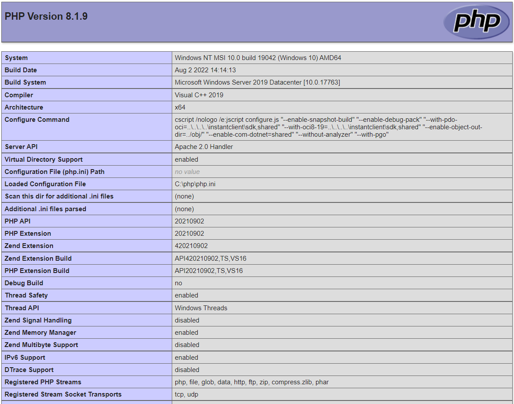

Bạn có thể cài đặt Apache, PHP, MySQL và phpMyAdmin trên Windows để làm web server trong khi bạn vẫn có thể sử dụng các ứng dụng khác như duyệt web.

Việc cài đặt một web server để sử dụng localhost trên Windows 7, 8, 10 là điều rất cần thiết để chạy thử nghiệm các trang web trước khi phát hành nó trực tuyến. Nếu như bạn đang sử dụng một VPS Windows mà lại không tận dụng để cài đặt một web server lên đó thì thật là đáng tiếc. Cũng như Ubuntu hay CentOS, các web server như Apache, Nginx cũng được hỗ trợ để cài đặt trên Windows.

Trong khi Apache có khả năng xử lý nội dung động (dynamic content) như PHP một cách tuyệt vời thì Nginx lại có thế mạnh để xử lý các nội dung tĩnh (static content) như hình ảnh, js, css… Nếu như bạn có một trang web có nhiều nội dung tĩnh như một web ảnh thì sử dụng cài đặt Nginx là hợp lý nhất.

Apache là web server thông dụng nhất trên thế giới. Vì thế các mã nguồn được hỗ trợ tốt trên Apache và đặc biệt là rất dễ dàng để sử dụng. Bài viết này sẽ hướng dẫn bạn cài đặt Apache, PHP, MySQL và phpMyAdmin trên Windows 7, 8, 10 từ source Apache Lounge.

## **Cài đặt Apache**
Bạn có thể dễ dàng cài đặt Apache bằng cách cài Apache webserver từ chương trình installer của WAMP Stack, WampServer hoặc XAMPP. Tuy nhiên ở đây mình chỉ cài Apache từ source để tiện cho việc tìm hiểu, tùy chỉnh việc cài đặt và cấu hình.

### **Bước 1: Download Apache từ source**
Download Apache source từ [Apache Lounge](https://www.apachelounge.com/download/) phiên bản 64 bit hoặc 32 bit.

Bản Apache VC15 được build trên Visual C++ Redistributable for Visual Studio 2017 ([VC_redist.x64.exe](https://go.microsoft.com/fwlink/?LinkId=746572) cho 64-bit hoặc [VC_redist.x86.exe](https://go.microsoft.com/fwlink/?LinkId=746571) cho 32-bit) nên bạn cần phải cài đặt nó trên Windows. Nếu bạn muốn cài đặt Apache trên Win XP thì hãy dùng bản [Apache VC10](http://www.apachelounge.com/download/VC10/) vì bàn VC15 không hỗ trợ Win XP.

### **Bước 2: Cài đặt Apache**
Sau khi download Apache từ source, hãy giải nén thư mục **Apache24** vào ổ **C**. Vì source này được build mặc định cho ổ C, nếu như bạn muốn cài đặt nó trên ổ D hoặc USB hay bất kỳ đâu thì bạn cần phải thay đổi lại cấu hình cho **DocumentRoo**… Vì các cấu hình hơi rắc rối nên mình sẽ để nó ở ổ C và để tên folder là Apache24 theo mặc định.

Như vậy là quá trình cài đặt Apache đã hoàn thành. Để khởi động Apache, vào thư mục **C:\Apache24\bin** và chạy file **httpd.exe**.

Bây giờ bạn có thể vào **http://localhost** để kiểm tra. Nếu như bạn nhìn thấy dòng **“It works!”** là bạn đã cài đặt và chạy Apache thành công.

Có thể bạn sẽ nhìn thấy thông báo này khi chạy file **httpd.exe**:
```
AH00558: httpd.exe: Could not reliably determine the server’s fully qualified domain name, using fe80::b93e:e93c:a570:f94a. Set the ‘ServerName’ directive globally to suppress this message
```

Đây chỉ là cảnh báo chứ không phải là lỗi. Để fix nó thì bạn cần phải gán giá trị cho mục **ServerName** trong file **C:\Apache24\conf\httpd.conf** như sau:

>#ServerName www.example.com:80

Bỏ dấu **“#”** phía trước và thay đổi giá trị thành **“localhost”** hoặc domain của bạn.

>ServerName localhost

Bây giờ bạn có thể tắt cửa sổ _httpd.exe_ và chạy lại file này để khởi động Apache xem thử còn lỗi không nhé.

#### **Bật mod_rewrite trong Apache trên localhost**
Để sử dụng được Wordpress Permalink hoặc rewrite cho htaccess thì bạn cần phải bật **mod_rewrite** trên localhost. Để bật **mod_rewrite** trong Apache, bạn cần mở file **C:\Apache24\conf\httpd.conf** và tìm đoạn sau:

>#LoadModule rewrite_module modules/mod_rewrite.so

Xóa dấu **“#”** ở trước để bật module này nhé. Sau khi xóa sẽ được như sau:

>LoadModule rewrite_module modules/mod_rewrite.so

Tiếp theo bạn cần tìm đến đoạn như sau:
```
<Directory “c:/Apache24/htdocs”>
………………….
AllowOverride None
………………….
</Directory>
```

Sửa AllowOverride None thành AllowOverride All như sau:
```
<Directory “c:/Apache24/htdocs”>
………………….
AllowOverride All
………………….
</Directory>
```

Restart Apache và kiểm tra. Bạn cũng có thể bật mod_rewrite trong XAMPP, WAMP, Appserv bằng cách làm tương tự.

### **Bước 3: Cài đặt service cho Apache**
Bạn có thể cài đặt để khởi động, restart, stop Apache thông qua một service của Windows. Bạn cũng có thể khởi động Apache cùng với máy tính nếu bạn muốn.

Mở **Command Prompt** hoặc **cmd** (Run as Administrator) và sử dụng các lệnh sau:
```
cd C:\Apache24\bin
httpd -k install
```

Như ở trên, bạn cần đi đến thư mục **bin** của Apache (**C:\Apache24\bin**) và sử dụng lệnh ```httpd -k install``` để cài đặt một service. Nếu thành công thì bạn sẽ nhìn thấy thông báo như sau:
```
Installing the ‘Apache2.4‘ service
The ‘Apache2.4’ service is successfully installed.
Testing httpd.conf….
Errors reported here must be corrected before the service can be started.
```
Theo mặc định thì Apache sẽ cài đặt service là “**Apache2.4**“. Bạn có thể cài đặt tên service theo ý muốn bằng cách sử dụng lệnh sau:
```
httpd -k install -n "ten-service"
```

Bạn có thể start, stop hoặc restart Apache trên Windows bằng cách start, stop hoặc restart service này ở **Control Panel > Administrative Tools > Services**. Hoặc bạn có thể sử dụng lệnh để start và stop service của Apache bằng cách mở **Command Prompt** hoặc **cmd** (Run as Administrator) và sử dụng các lệnh sau:
```
# start Apache
net start Apache2.4

# stop Apache
net stop Apache2.4
```
Mặc định thì service của Apache sẽ tự động khởi động cùng với Windows. Điều đó có nghĩa là Apache sẽ tự khởi động khi bạn bật máy tính. Nếu bạn muốn khởi động Apache thủ công, nhấn đúp vào service và thay đổi mục **Startup type** thành **Manual**.

Để gỡ service này, sử dụng lệnh sau:
```
sc delete Apache2.4
```
Như vậy là bạn đã cài đặt Apache trên Windows xong. Tiếp theo bạn cần cài đặt và cấu hình cho PHP hoạt động với Apache.

## **Cài đặt PHP**
PHP có sẵn để cài đặt trên Windows và nó cũng được build với VC9, VC11, VC14 của Apache Lounge. PHP có cả 2 bản 32 bit và 64 bit chứ không giống như XAMPP chỉ có 32 bit. PHP không chỉ hỗ trợ cho Apache mà còn hỗ trợ cho Nginx và IIS nữa nhé.

### **Bước 1: Download PHP cho Windows**
Để cài đặt PHP trên Windows, bạn cần phải [download PHP](http://windows.php.net/download/) cho Windows về máy. Sau đó giải nén vào một thư mục tùy ý và copy vào ổ **C**. Ở đây mình sẽ dùng bản PHP 8 (64 bit) và giải nén ra thư mục là **php**.

Nếu bạn nào muốn sử dụng PHP như là một module (**mod_php**) của Apache (**Apache Handlers**) thì download bản **Thread Safe**. Nếu bạn muốn sử dụng PHP thông qua **FastCGI** thì download bản **Non Thread Safe**.

Cũng như Apache Lounge, PHP được build với VC9 ([32 bit](http://www.microsoft.com/en-us/download/details.aspx?id=5582) hoặc [64 bit](http://www.microsoft.com/en-us/download/details.aspx?id=15336)), [VC11](http://www.microsoft.com/en-us/download/details.aspx?id=30679) và VC15 ([64-bit](https://go.microsoft.com/fwlink/?LinkId=746572) hoặc [32-bit](https://go.microsoft.com/fwlink/?LinkId=746571)) nên bạn cần phải cài đặt các phần mềm tương ứng. Nếu bạn muốn cài đặt Apache và PHP trên Windows XP, bạn chỉ có thể sử dụng Apache VC10 và PHP 5.4 bản VC9.

### **Bước 2: Tạo file php.ini**
Sau khi giải nén và copy thư mục **php** vào ổ **C**, bạn cần phải tạo file **php.ini** để cấu hình cho PHP. Trong thư mục **C:\php** sẽ có file **php.ini-production**, bạn nên copy file này và đổi tên thành **php.ini** nhé.

### **Bước 3: Bật module cho PHP**
Sau khi đã tạo file **php.ini** thì bây giờ bạn có thể cấu hình cho PHP theo ý bạn muốn. Ở đây mình chỉ hướng dẫn bạn bật các module cần thiết để chạy trang web.

Để hỗ trợ các tính năng hay các function của PHP mà bạn cần, bạn phải bật các PHP modules (extension) tương ứng. Ví dụ để sử dụng được CURL trong PHP thì bạn phải bật php_curl hoặc muốn kết nối tới MySQL với PHP thì phải bật __php_mysqli__ vậy.

Các modules (extension) của PHP nằm trong thư mục **ext**. Để bật các modules này thì bạn cần phải cấu hình file **php.ini** để khai báo thư mục **ext** và các file modules.

Mở file php.ini và tìm đoạn sau:

>; extension_dir = “ext”

Xóa dấu “;” ở trước đoạn trên:

>extension_dir = “ext”

Để bật các modules (extensions) cho PHP, tìm đến những đoạn như ```;extension=php_bz2.dll``` và tương ứng với module mà bạn muốn bật, sau đó xóa bỏ dấu “;” ở trước. Ví dụ ở đây mình sẽ bật module gd, curl, mysqli, soap thì mình sẽ bật như sau:
```
extension=php_curl.dll
extension=php_gd2.dll
extension=php_mysqli.dll
extension=php_soap.dll
```
Như vậy là bạn đã hoàn thành việc cài đặt PHP trên Windows rồi. Bây giờ chỉ việc cấu hình để Apache có thể chạy được PHP thôi.

## **Cấu hình Apache chạy PHP**
Để Apache có thể chạy được PHP, bạn cần phải cấu hình cho Apache sử dụng mod_php hoặc sử dụng CGI để xử lý PHP. Ở đây mình sẽ hướng dẫn bạn cấu hình để Apache có thể chạy PHP với hai phương pháp trên.

Nếu bạn muốn sử dụng `mod_php`, bạn cần phải tải về phiên bản **Thread Safe** (NTS) của PHP. Nếu bạn muốn sử dụng **FastCGI**, bạn cần phải tải về phiên bản **Non Thread Safe** (TS). Trong bài viết này, tôi sử dụng `mod_php`.

### **Sử dụng mod_php (Apache 2.0 Handler)**
Cách dễ dàng nhất để Apache chạy PHP là sử dụng **mod_php**. PHP sẽ được xử lý thông qua một module của PHP, ngay ở bên trong Apache và không cần đến một máy chủ ở bên ngoài.

Sử dụng **mod_php** là nhanh hơn nhiều so với các máy chủ xử lý PHP khác như CGI, FastCGI nhưng nó cũng có nhiều nhược điểm khác.

Để cấu hình cho Apache xử lý PHP sử dụng mod_php, bạn cần phải cấu hình trong file **C:\Apache24\conf\httpd.conf**. Mở file **httpd.conf** và thêm đoạn sau vào cuối cùng của file:
```
LoadModule php5_module "c:/php/php5apache2_4.dll"
AddHandler application/x-httpd-php .php
PHPIniDir "C:/php"
```
Trong thư mục **C:/php** của bạn sẽ có một file dạng như “php5apache2_4.dll”, bạn cần phải thay thế tên file để có một cấu hình phù hợp cho bạn. Nếu bạn đang sử dụng PHP 7, thì bạn cần phải thay đổi “**php5_module**” thành “**php7_module**” và file **php7apache2_4.dll**.
```
LoadModule php7_module "c:/php/php7apache2_4.dll"
AddHandler application/x-httpd-php .php
PHPIniDir "C:/php"
```
Nếu bạn dùng PHP 8, thì:
```
LoadModule php_module "c:/php/php8apache2_4.dll"
AddHandler application/x-httpd-php .php
PHPIniDir "C:/php"
```

Cấu hình trên sẽ cho phép **mod_php** được load và sẽ xử lý PHP cho tất cả file nào có chứa **.php**. Các file như **vidu.php.txt** cũng sẽ được xử lý như PHP, điều này là không cần thiết và gây ra lãng phí. Để cấu hình cho Apache chỉ LoadModule **mod_php** cho các file có đuôi cuối cùng là **.php** thì bạn cần sửa lại như sau:
```
<FilesMatch \.php$>
  LoadModule php_module "c:/php/php8apache2_4.dll"
  SetHandler application/x-httpd-php
</FilesMatch>

# configure the path to php.ini
PHPIniDir "C:/php"
```
Lưu file **httpd.conf** và restart Apache. Để kiểm tra Apache đã chạy được PHP hay chưa, bạn cần tạo một file **phpinfo.php** trong **C:\Apache24\htdocs** với nội dung:
```
<?php phpinfo(); ?>
```

Sau đó vào ```http://localhost/phpinfo.php``` để kiểm tra.


Nếu bạn thấy mục “**Server API**” là “**Apache 2.0 Handler**” thì bạn đã cấu hình Apache chạy PHP sử dụng mod_php thành công.